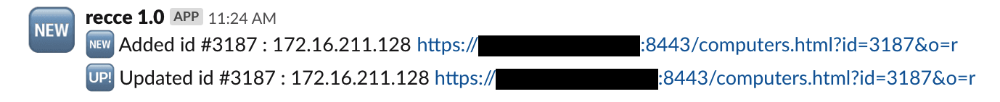

# Recce

Early on we decided to use [JAMF](https://www.jamf.com/) to track our PC's as well manage our MacOS and iOS devices. We continued using recon.exe after it was deprecated, but as the writing was on the wall (and the release notes),  another solution would be needed. I leveraged the experience I gained from writing [Tugboat](https://github.com/univ-of-utah-marriott-library-apple/scl_jamf_tools/blob/master/tugboat/README.md) and [Cargo Ship](https://github.com/univ-of-utah-marriott-library-apple/scl_jamf_tools/blob/master/cargo_ship/README.md) to develop Recce, a recon.exe replacement.

Recce duplicates much of the original recon.exe binary and uses JAMF's REST API to upload the inventory information. Using JAMF's API is a safe and reliable way to read and write data to your JAMF instance.

You can learn how to pronounce "recce" and learn more about the project [here](https://stream.lib.utah.edu/index.php?c=details&id=13177).

## Contents

- [Download](#download)
- [Contact](#contact)
- [System Requirements](#system-requirements)
- [Install](#install)
- [Uninstall](#uninstall)
- [Purpose](#purpose)
  - [What doesn't it do, compared to recon.exe?](#what-doesnt-it-do-compared-to-reconexe)
- [Usage](#usage)
  - [Flags](#flags)
  - [Configuration File](#configuration-file)
  - [Slack](#slack)
  - [Duplicated Values](#duplicated-values)
  - [Log](#log)
  - [User  privileges](#user-privileges)
- [Rebuilding the Windows application](#rebuilding-the-windows-application)
- [Program organization](#program-organization)
  - [recce.py](#reccepy)
  - [jss_login.py](#jss_loginpy)
  - [windows_computer.py](#windows_computerpy)
- [How can you help?](#how-can-you-help)
  - [Linux/macOS support](#linuxmacos-support)
  - [Proper client side security](#proper-client-side-security)
- [Update History](#update-history)

## Download

[Download the latest package here!](../../releases/)

## Contact

If you have any comments, questions, bug reports, pull requests or other input, either [file an issue](../../issues) or [send us an email](mailto:mlib-its-mac-github@lists.utah.edu). Thanks!

## System Requirements

These requirements only apply if you're attempting to execute the raw source code. The provided binary doesn't require the following to be present:

- Python 3+ (which you can download [here](https://www.python.org/download/))
- Requests 2.21.0+ (more info [here](http://docs.python-requests.org/en/master/))

## Install

The repository contains a precompiled version of Recce.

## Uninstall

Simply delete the executable and the configuration file.

## Purpose

Recce was originally meant to replace the features provided by the deprecated recon.exe Windows application provided by JAMF.  However, it became clear during development that Recce could become a framework for adding unmanaged machines of other operating systems as well.

### What doesn't it do, compared to recon.exe?

For our purposes, we decided not to duplicate the entire spectrum of information that recon.exe gathers. We're ignoring the categories that were particularly time-consuming to collate or that we are tracking though other methods. These areas include:

- Fonts
- Users
- Applications

In addition, this release only supports Windows. If enough interest exists and time allows, modules for other operating systems may be added in the future. Also, the code is written in such a way that would allow a third party to create or modify an OS module easily.

## Usage

The compiled version of Recce can be used like any other binary, as part of a scheduled job, for example. It can be used in the Windows GUI as a double-clickable application, where a shell window is opened on launch, or executed directly from a command shell.

When Recce is launched it will look for its configuration file. If it finds it in the same directory, it will create the log file in the same directory. If it finds the configuration file in the OS-specific location, the log file will be created in an OS-specific location as well.

Here is a chart to help you locate the files:

| Operating System | Configuration file location                                | Log file location                        |
| ---------------- | ---------------------------------------------------------- | ---------------------------------------- |
| Windows          | `C:\ProgramData\edu.scl.utah.recce\edu.scl.utah.recce.ini` | `C:\Users\[username]\AppData\Local\Temp` |


### Flags

Recce, being a command line tool, provides a number of flags that can be used to modify it's behavior.

| flag                   | description |
| ---------------------- | ----------- |
| `-s, --system_specific` | Instead of creating a new configuration file in the same directory as the Recce binary, place it in an OS appropriate location. |
| `-m, --manual_login`    | Overriding any existing configuration file, ask for username, password, JAMF hostname and Slack info. |
| `-q, --quit_config`     | If a configuration file can't be located, exit the script without attempting to connect to a JAMF server. |

### Configuration file

The configuration file, `edu.scl.utah.recce.ini`, allows Recce to run without user input. The file will be created automatically the first time the tool is successfully used to communicate with a JAMF server. When the file is created the users password is written in base64 format. This is only enough to keep a casual observer from finding the password for the user. Care should therefore be taken with allowing uncontrolled access to the config file.

The file will look similar to the following:

```
[login]
hosts = https://your.jamf.server:8443
username = your_recce_user
access = <strong_password_here>

[slack]
slack_info_url = https://hooks.slack.com/services/your/slack/channel
```

### Slack

If you have provided a Slack channel in the configuration file, Recce will send informative reports. These reports include New and Updated machine records, the JAMF id number for the machine and a URL to the machine.

Here is an example of Recce messages in Slack, it shows a new computer being added and an updating computer:



### Duplicated Values

While this may be a peculiarity unique to our environment, I suspect other sites may experience the joy of motherboards sharing duplicated values. These may simply be blank serial numbers, or the scourge of duplicated UUID's. If Recce attempts to write values to the JSS and a duplicated value is detected preventing the write from completing, Recce will reformat the value so it can be easily found on the JSS and will be a unique value.

Here is a sample duplicate value message. The duplicate value is show in brackets (`To be filled by O.E.M.`), it is followed by the category of the value and a random value.

`[To be filled by O.E.M.] duplicate serial [3fc1e4]`

Slack will display the following text when it has detected duplicate values:


### Log

The log file created by Recce is quite verbose. However, I feel that with a log file in hand, one can easily follow the logic of the program. If you find Recce isn't completing properly on a machine, please file a bug report and include the entire log file.

### User privileges

This chart shows the required privileges for the Recce user to operate properly:

| Field               | Create | Read | Update | Delete | Notes                          |
| ------------------- | :----: | :--: | :----: | :----: | :----------------------------- |
| Accounts and Groups |        |  ☑   |        |        | Needed for login functionality |
| Computers           |   ☑    |  ☑   |   ☑    |        |                                |
| LDAP Servers        |        |  ☑   |        |        | Needed for login functionality |
| Users               |   ☑    |  ☑   |   ☑    |        |                                |

### Rebuilding the Windows application

If you need to make changes to the source code of Recce, building an executable version requires the [Pyinstaller](https://pyinstaller.readthedocs.io/en/stable/) package to be installed. Having an executable version eliminates the need to have Python installed on your clients. This is the pyinstaller command I use to build recce.exe:

`pyinstaller --onefile --version-file file_version_info_recce.txt recce.py`

## Program organization

The source code for Recce is divided into multiple modules, in order to avoid duplications and maintain efficient organization.

#### recce.py

Handles launching of the script, OS detection, log file creation and flow control.

#### jss_login.py

Handles the interaction with the JSS to confirm user credentials and privileges to make changes as required by Recce.

#### windows_computer.py

Handles the gathering and formatting of hardware, disk and networking information of machines running Microsoft Windows. Windows 7 and 10 have been tested, others may be supported. Most of this info is gathered through the `wmic` command

## How can you help?

I'm glad you asked!

### Linux/macOS support

I wrote Recce with the idea that other OS's could be supported using a similar methodology as the windows_computer.py module. I've provided data structures and supporting methods to handle most of the information handling and uploading. The non-trivial gathering of that data (disks, hardware, networking, etc.) is left to the user. However, if we get enough requests, I may consider adding additional OS support.

### Proper client side security

The user password is minimally obfuscated. Pull requests offering additional safeguards are requested.


## Update History

| Date       | Notes            |
| ---------- | ---------------- |
| 2019.07.16 | Initial release. |
